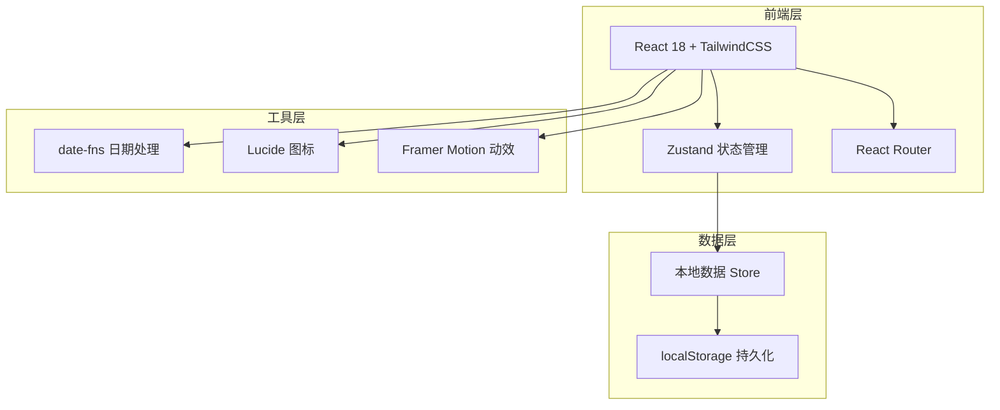
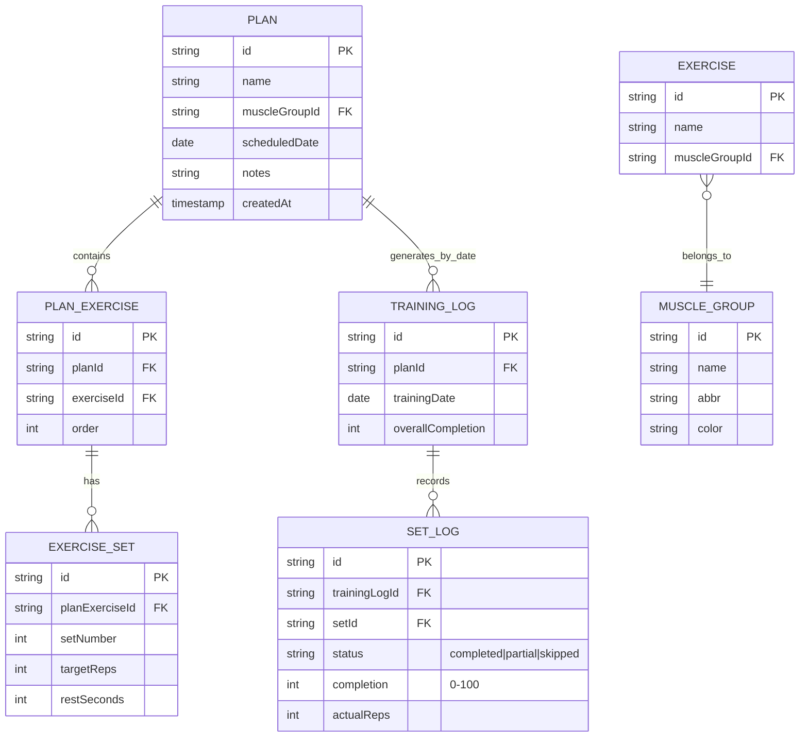

## 1. 架构设计



## 2. 技术说明
- **前端**：React@18 + TailwindCSS@3 + Vite
- **初始化工具**：vite-init (react-ts 模板)
- **状态管理**：Zustand（轻量、本地持久化中间件）
- **路由**：React Router v6
- **日期处理**：date-fns
- **图标**：lucide-react
- **动效**：framer-motion
- **后端**：无（个人应用，数据存 localStorage）
- **数据库**：无，使用 localStorage 持久化

## 3. 路由定义
| 路由 | 用途 |
|-------|---------|
| `/` | 重定向至日历总览页 |
| `/calendar` | 日历总览页（月历 + 当日计划） |
| `/plans` | 计划管理页（计划列表 + 创建/编辑） |
| `/train/:date` | 训练详情页（指定日期的训练） |

## 4. 数据模型

### 4.1 数据模型定义



### 4.2 数据定义（localStorage Schema）

```typescript
// 肌肉群（预置数据）
interface MuscleGroup {
  id: string;
  name: string;        // 胸肌 / 背部 / 肩部 / 手臂 / 腿部 / 核心 / 臀部
  abbr: string;        // CHST / BACK / SHLD / ARMS / LEGS / CORE / GLUT
  color: string;       // hex 色值
}

// 预置动作库
interface Exercise {
  id: string;
  name: string;        // 杠铃卧推 / 引体向上 / 哑铃推举 ...
  muscleGroupId: string;
}

// 训练计划
interface Plan {
  id: string;
  name: string;        // 计划名 e.g. "推日 A"
  muscleGroupId: string;
  scheduledDate: string; // YYYY-MM-DD
  notes?: string;
  exercises: PlanExercise[];
  createdAt: number;
}

interface PlanExercise {
  id: string;
  exerciseId: string;
  exerciseName: string; // 冗余存储，避免动作库变更影响历史
  sets: PlanSet[];
}

interface PlanSet {
  id: string;
  targetReps: number;
  restSeconds: number;
}

// 训练完成记录（按日期 + 计划）
interface TrainingLog {
  id: string;
  planId: string;
  date: string;        // YYYY-MM-DD
  setLogs: SetLog[];
  updatedAt: number;
}

interface SetLog {
  setId: string;       // 对应 PlanSet.id
  status: 'completed' | 'partial' | 'skipped' | 'pending';
  completion: number;  // 0-100，由 status 与用户输入计算
  actualReps?: number;
}
```

### 4.3 预置肌肉群与动作库

**肌肉群**：
| 名称 | 缩写 | 颜色 |
|------|------|------|
| 胸肌 | CHST | #FF6B35 |
| 背部 | BACK | #4ECDC4 |
| 肩部 | SHLD | #FFD23F |
| 手臂 | ARMS | #C6FF3D |
| 腿部 | LEGS | #FF5E8A |
| 核心 | CORE | #A78BFA |
| 臀部 | GLUT | #60A5FA |

**预置动作（部分）**：
- 胸肌：杠铃卧推、哑铃飞鸟、上斜哑铃推举、双杠臂屈伸、绳索夹胸
- 背部：引体向上、杠铃划船、高位下拉、坐姿划船、直臂下压
- 肩部：哑铃推举、侧平举、前平举、反向飞鸟、面拉
- 手臂：杠铃弯举、哑铃锤式弯举、绳索下压、窄距俯卧撑、集中弯举
- 腿部：杠铃深蹲、腿举、罗马尼亚硬拉、腿弯举、保加利亚分腿蹲
- 核心：平板支撑、卷腹、俄罗斯转体、悬垂举腿、山羊挺身
- 臀部：臀桥、罗马尼亚硬拉、保加利亚分腿蹲、臀推、蛙泵
